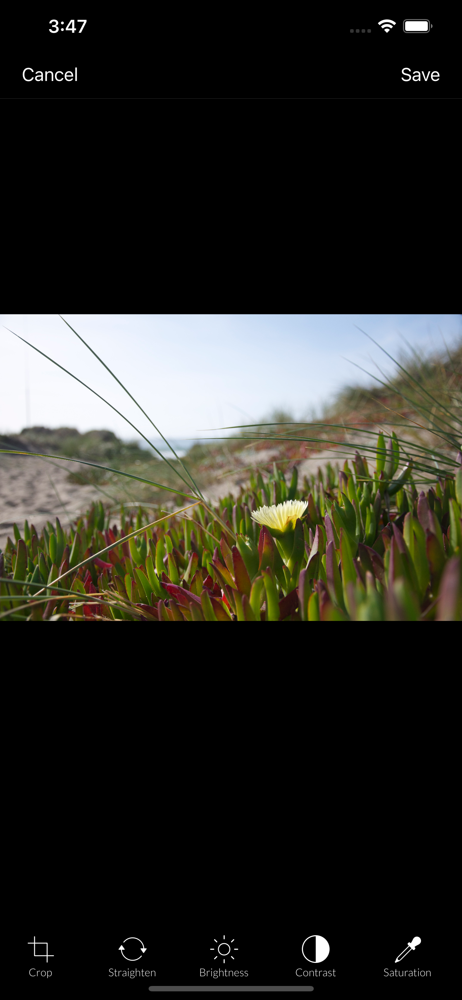

<!-- PROJECT LOGO -->
<br />
<p align="center">
   <a href="https://github.com/bilaldurnagol/PhotoFilterRxSwift">
    
  </a>

  <h3 align="center">Photo Filter with RxSwift</h3>

  <p align="center">
    It is a project where you can learn CoreImage, Photos and Rxswift libraries in depth.
    <br />
    <a href="https://github.com/bilaldurnagol/PhotoFilterRxSwift"><strong>Explore the docs »</strong></a>
    <br />
    <br />
    <a href="https://github.com/bilaldurnagol/PhotoFilterRxSwift">View Demo</a>
    ·
    <a href="https://github.com/bilaldurnagol/PhotoFilterRxSwift/issues">Report Bug</a>
    ·
    <a href="https://github.com/bilaldurnagol/PhotoFilterRxSwift/issues">Request Feature</a>
  </p>
</p>


<!-- TABLE OF CONTENTS -->
<details open="open">
  <summary>Table of Contents</summary>
  <ol>
    <li>
      <a href="#about-the-project">About The Project</a>
      <ul>
        <li><a href="#built-with">Built With</a></li>
      </ul>
    </li>
    <li>
      <a href="#getting-started">Getting Started</a>
      <ul>
        <li><a href="#Requirements">Requirements</a></li>
        <li><a href="#installation">Installation</a></li>
      </ul>
    </li>
    <li><a href="#usage">Usage</a></li>
    <li><a href="#roadmap">Roadmap</a></li>
    <li><a href="#contributing">Contributing</a></li>
    <li><a href="#license">License</a></li>
    <li><a href="#contact">Contact</a></li>
  </ol>
</details>

<!-- ABOUT THE PROJECT -->
## About The Project

 With this project, we can edit, crop and share photos on social media with presets filters.

   <a href="https://github.com/bilaldurnagol/PhotoFilterRxSwift">
    
  </a>

   <a href="https://github.com/bilaldurnagol/PhotoFilterRxSwift">
    
  </a>
  
   <a href="https://github.com/bilaldurnagol/PhotoFilterRxSwift">
    
  </a>
     <a href="https://github.com/bilaldurnagol/PhotoFilterRxSwift">
    
  </a>


Here's why:
* To learn CoreImage and Photos Library
* To learn RxSwift and reactive programming.

### Built With

The frameworks I used in this project are listed below.
* [RxSwift](https://github.com/ReactiveX/RxSwift)
* [CoreImage](https://developer.apple.com/documentation/coreimage)
* [Photos](https://developer.apple.com/documentation/photokit)
<!-- GETTING STARTED -->
## Getting Started

 This is an example of how you may give instructions on setting up your project locally. To get a local copy up and running follow these simple example steps.

### Requirements

* Xcode 12.x
* Swift 5.x

For Xcode 11 and below, [use RxSwift 5.x](https://github.com/ReactiveX/RxSwift/releases/tag/5.1.1).

### Installation

RxSwift doesn't contain any external dependencies.

These are currently the supported installation options:

### Manual

Open Rx.xcworkspace, choose `RxExample` and hit run. This method will build everything and run the sample app

### [CocoaPods](https://guides.cocoapods.org/using/using-cocoapods.html)

```ruby
# Podfile
use_frameworks!

target 'YOUR_TARGET_NAME' do
    pod 'RxSwift', '6.1.0'
    pod 'RxCocoa', '6.1.0'
end

# RxTest and RxBlocking make the most sense in the context of unit/integration tests
target 'YOUR_TESTING_TARGET' do
    pod 'RxBlocking', '6.1.0'
    pod 'RxTest', '6.1.0'
end
```

Replace `YOUR_TARGET_NAME` and then, in the `Podfile` directory, type:

```bash
$ pod install
```
<!-- USAGE EXAMPLES -->
## Usage

<table>
  <tr>
    <th width="30%">Here's an example</th>
  </tr>
  <tr>
    <td>Filter a photo...</td>
  </tr>
  <tr>
    <td><div class="highlight highlight-source-swift"><pre>
    private func applyFilter(to inputImage: UIImage, value: Float, myFilter: Filters, completion: @escaping ((UIImage) -> ())) {
        
        let filter = CIFilter(name: myFilter.filterName)!
        filter.setValue(value, forKey: myFilter.filterKey)
        
        if let sourceImage = CIImage(image: inputImage) {
            
            filter.setValue(sourceImage, forKey: kCIInputImageKey)
            
            if let cgimg = self.context.createCGImage(filter.outputImage!, from: filter.outputImage!.extent) {
                
                let processedImage = UIImage(cgImage: cgimg, scale: inputImage.scale, orientation: inputImage.imageOrientation)
                completion(processedImage)
            }
        }
    }
  </tr>
</table>


<!-- LICENSE -->
## License

Distributed under the MIT License. See `LICENSE` for more information.


<!-- CONTACT -->
## Contact
   <a href="https://twitter.com/bilaldurnagol">
  
</a>

   <a href="https://medium.com/@BilalDurnagol">
  
</a>

   <a href="https://www.instagram.com/bilaldurnagol/">
  
</a>

   <a href="https://www.linkedin.com/in/bilaldurnagol">
  
</a>
<br/>
<br/>
  

Project Link: [https://github.com/bilaldurnagol/PhotoFilterRxSwift](https://github.com/bilaldurnagol/PhotoFilterRxSwift)
